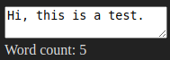

===================

Byteshift Elements is a tiny WebComponents microframework which allows you to
build simple, *reactive*, self-contained custom elements. Byteshift Elements is
a *zero-dependency* library, and is designed to be incorporated inside bundled
javascript packages.

The library is designed to be used with TypeScript. Apart from the TypeScript
compiler, there is no additional compilation step necessary for your components
to run. Custom elements designed with Byteshift Elements are running on native
Javascript inside the browser, utilizing native DOM manipulation API's without
custom parsing / rendering techniques that would otherwise degrade the
performance of your application.

Although this library shares some functionality with libraries like Vue, it
tries to solve a different problem: Being able to design components that utilize
the ShadowDOM entirely to minimize compatibility issues or styling conflicts on
existing websites. While being reasonably small, Byteshift Elements is designed
to be bundled with your own bundled javascript library, as it doesn't have any
dependencies by itself, nor does it leak or expose data to the window/global
scope.

Example component:

```ts
// ./Components/HelloWorld.ts
import {Component, AbstractComponent} from '@byteshift/elements';

@Component({
    selector: 'hello-world',
    attributes: ['my-name'],
    template: `
        <header>
            Hello, {{ myName }}
        </header>
        <main>
            <slot></slot>
        </main>
    `,
    stylesheet: {
        // Host style.
        display: 'flex',
        flexDirection: 'column',
        justifyContent: 'center',
        alignItems: 'center',

        // Child elements
        'header': {
            fontSize: '24px',
            padding: '10px',
            borderBottom: '1px solid #aaa'
        },
        'main': {
            padding: '10px'
        }
    }
})
export class HelloWorld extends AbstractComponent
{
    public myName: string = 'John Doe';
}
```

```ts
// Your applications main.ts or something similar
import {Elements} from '@byteshift/elements';
import {HelloWorld} from './Components/HelloWorld.ts';

Elements.register(HelloWorld);
```

```html
<hello-world my-title="Harold Iedema">
    Slotted content here.
</hello-world>
```

This component would look something like this:


-----

## Reactivity

Class properties are reactive by default, meaning they can be referenced within
the template using the template syntax `{{ variableName }}`. All text nodes
within the component are scanned when it is first created and split up over
multiple new nodes. A template is hereby replaced with a text node which will
have its contents updated automatically as soon as the referenced variable
changes.

An error is thrown if a referenced property does not exist in the component.

Templates are in reality evaluated within their respective component context,
meaning you can do more than simply reference an arbitrary class property.

```ts
@Component({
    selector: 'hello-world',
    template: `
        <div>
            Is it real? {{ isReal ? 'Yes, it is!' : 'Nope.' }}
        </div>
    `
})
export class HelloWorld extends AbstractComponent
{
    private isReal: boolean = false;

    // Invoked as soon as the element is created and connected to the DOM.
    public onCreate(): void
    {
        setTimeout(() => this.isReal = true, 2000);
    }
}
```

The example above will show `Is it real? Nope.` as soon as the element is
created and connected to the DOM. After two seconds, it detects a change in the
`isReal` property and will update the text node to: `Is it real? Yes, it is!`.

Attributes are also reactive. If you would update the `my-name` attribute of the
first example in this README, you'd notice the title of the component being
updated immediately by whatever value you gave the attribute.


## Reactive element attributes

HTML elements can have their attributes updated reactively whenever the value of
a property changes. Any attribute starting with a colon (`:`), except for
`:style` and `:class` (more on that later), will have its value evaluated
everytime a _referenced_ property is updated.

Imagine having a `myTitle` property in your component which reflects a `title`
attribute of a button.

```html
<button :title="myTitle">Hover me!</button>
```

Since attributes are evaluated when they need to, you can also add more
complexity like updating a title only if a certain condition is true.

```html
<button :title="isValid ? myTitle : null">Hover me!</button>
```

## Reactive style attribute

Styling can be applied to any element reactively by adding the `:style`
attribute. CSS rules should be written conforming their javascript names, in
camelCase ("backgroundColor", rather than "background-color"). The attribute
should be filled with a value that resembles a JSON object where the value of
each key is _evaluated_ using the context of the component instance.

```ts
@Component({
    selector: 'hello-world',
    template: `
        <div :style="{color: myColor}">
            My color is {{ myColor }}!
        </div>
    `
})
export class HelloWorld extends AbstractComponent
{
    private myColor: string = 'red';

    // Invoked as soon as the element is created and connected to the DOM.
    public onCreate(): void
    {
        setTimeout(() => this.myColor = 'blue', 2000);
    }
}
```

This will show `My color is red!` for the first two seconds, after which it will
swap to `My color is blue!`.

## Reactive class attribute

Just like the `:style` attribute, the `:class` attribute works the same way. The
value of `:class` should be a JSON object in which each key represents a class
and each value is evaluated. If the value is truthy, the class is added, whereas
falsy, the class would be removed.

```ts
@Component({
    selector: 'hello-world',
    template: `
        <div :class="{active: isActive}">
            Hello World!
        </div>
    `,
    stylesheet: {
        'div': {
            display: 'none',
            '.active': {
                display: 'block'
            }
        }
    }
})
export class HelloWorld extends AbstractComponent
{
    private isActive: boolean = false;

    // Invoked as soon as the element is created and connected to the DOM.
    public onCreate(): void
    {
        setTimeout(() => this.isActive = true, 2000);
    }
}
```

For the first two seconds, this component won't render anything. After two
seconds, `isActive` is set to `true` and because of this, the `active` class
is added to the `div` in the template.

## Two-way binding

Form elements can be bound to a class property of your component to enable
two-way binding, using the `bind` attribute. All default HTML form elements are
supported:

 - input (type=text, number, radio, checkbox, color)
 - select
 - textarea
 
> (!) date/datetime/file are on the TODO list

```ts
@Component({
    selector: 'hello-world',
    template: `
    <textarea bind="myText"></textarea>
    <div>Word count: {{ wordCount }}</div>
    `,
})
export class HelloWorld extends AbstractComponent
{
    private myText: string = '';
    private wordCount: number = 0;

    @Watch('myText')
    private onTextChanged(newVal: string): void
    {
        this.wordCount = newVal.split(' ').filter(word => word.length > 0).length;
    }
}
```


### Select elements

Select elements have the ability to generate their items based on an array
property inside the component. When items are added or removed to or from the
list, the select element is updated as well.

Items can be represented as a plain list of strings like `['A', 'B', 'C']` or
a list of objects in which a `label` and `value` are defined, like so:

```ts
private myItems: any[] = [
    { label: 'First', value: 1 },
    { label: 'Second', value: 2 },
    { label: 'Third', value: 3 }
]
```

The keys `label` and `value` may be modified by passing the `label-key` and
`value-key` attributes to the select element.

```html
<select bind="mySelectedItem" items="myItems"></select>
```

## Watch methods

A method can be invoked each time a property is updated by decorating it with
the `@Watch` decorator.

```ts
@Component({
    // ...
})
export class HelloWorld extends AbstractComponent
{
    private isActive: boolean = false;

    // Invoked as soon as the element is created and connected to the DOM.
    public onCreate(): void
    {
        setTimeout(() => this.isActive = true, 2000);
    }
    
    @Watch('isActive')
    private onActiveChanged(newVal: boolean): void
    {
        console.log('isActive changed to', newVal);
    }
}
```

Each time `isActive` is updated, the method `onActiveChanged` is invoked and is
given the new value as its first argument.

Watchers are invoked _immediately_ by default, which means they are also invoked
when the component is created. You can disable this by passing `false` to the
second argument of `@Watch`. For example: `@Watch('isActive', false)`.

## Iterators / Loops

When a property is an array, it can be used to render multiple elements.

```ts
@Component({
    selector: 'iterator-test',
    template: `
        <div iterate="name in names">
            Hello {{ name }}
        </div>
    `
})
export class IteratorTest extends AbstractComponent
{
    private names: string[] = ['Hank', 'Pete', 'Abigail'];
}
```

The example above will render:
> Hello Hank
>
> Hello Pete
>
> Hello Abigail

Iterators can even be used combined with conditionals within the same element.
Let's take the same example as above, but only render names that start with the
letter A.

```ts
@Component({
    selector: 'iterator-test',
    template: `
        <div
            iterate="name in names"
            if="name.startsWith('A')"
        >
            Hello {{ name }}
        </div>
    `
})
export class IteratorTest extends AbstractComponent
{
    private names: string[] = ['Hank', 'Pete', 'Abigail'];
}
```

You could even use the current item of the iterator to perform conditional
inline styling on the element. This example will render the name Abigail in red.
```ts
@Component({
    selector: 'iterator-test',
    template: `
        <div
            iterate="name in names"
            :style="{color: name === 'Abigail' ? 'red' : 'black'}"
        >
            Hello {{ name }}
        </div>
    `
})
export class IteratorTest extends AbstractComponent
{
    private names: string[] = ['Hank', 'Pete', 'Abigail'];
}
```

## Events

Events can be emitted using the `$emit()` method inside a component. This will
emit a native `CustomEvent` object which holds a `.detail` property that will
contain the data you passed to the `$emit()` method.

Listening to events can be done by adding an attribute starting with an `@`,
followed by the name of the event.

Let's take the following example where our element has an input field. Whenever
the value of the field changes, the `change` event is emitted.

```ts
@Component({
    selector: 'event-test',
    template: `
        Name: <input type="text" bind="userInput">
    `
})
export class EventTest extends AbstractComponent
{
    private userInput: string = '';
    
    @Watch('userInput')
    private onUserInputChanged(newVal: string): void
    {
        this.$emit('change', newVal);
    }
}
```

Let's listen to this event:

```ts
@Component({
    selector: 'event-listener-test',
    template: `
        <event-test @change="update($event.detail)"></event-test>
    `
})
export class EventListenerTest extends AbstractComponent
{
    private update(value: string): void
    {
        console.log('The new value is: ', value);
    }
}
```
